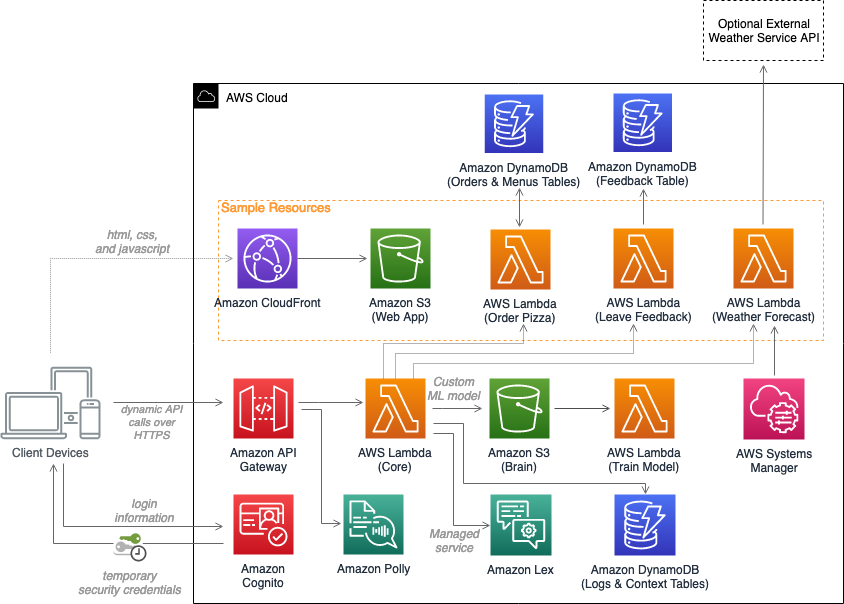

# Serverless Bot Framework
⚡ Serverless Bot Framework 🤖 is a scalable and high-available multi-language conversational AudioBot & ChatBot, support Amazon Lex V2 Console and API integration for an improved bot building experience. 👍

## Architecture

 quickly assemble  applications using familiar programming tools. 

AWS Solutions Constructs are vetted architecture patterns, available as an open-source extension of the AWS Cloud Development Kit (CDK), that can be  Below you will find a directory of the patterns made available through AWS Solutions Constructs.

[AWS CDK Solutions Constructs](https://aws.amazon.com/solutions/constructs/patterns) are pre-built, multi-service architecture patterns that allow customers to easily assembled declaritively to create a well-architected & production-ready workload.

AWS Solutions Constructs are available as an open-source extension of the AWS Cloud Development Kit (CDK). This solution uses the following AWS CDK Constructs:

* [aws-cognito-apigateway-lambda](https://docs.aws.amazon.com/solutions/latest/constructs/aws-cognito-apigateway-lambda.html)
* [aws-lambda-dynamodb](https://docs.aws.amazon.com/solutions/latest/constructs/aws-lambda-dynamodb.html)
* [aws-cloudfront-s3](https://docs.aws.amazon.com/solutions/latest/constructs/aws-cloudfront-s3.html)
* [aws-s3-lambda](https://docs.aws.amazon.com/solutions/latest/constructs/aws-s3-lambda.html)
* [aws-lambda-s3](https://docs.aws.amazon.com/solutions/latest/constructs/aws-lambda-s3.html)

## Deployment

`./deploy.sh`

### Prerequisites:
* [ ] [AWS Commandline Interface](https://aws.amazon.com/cli/)
* [ ] Node.js 12.x or later
* [ ] (Optional) [AccuWeather](https://developer.accuweather.com/) or [OpenWeather](https://openweathermap.org/api) API keys
